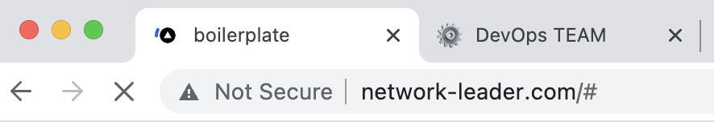

날짜: 2022년 7월 29일

# 수행내용

이번 주에는, Route 53, ELB(Elastic Load Balancer) 그리고 대상 그룹 설정에 대해 공부하였습니다. 먼저, 도메인 이름을 등록해보기로 결정했습니다. 이를 위해 AWS Route 53 서비스를 사용했습니다.

Route 53이란, 높은 가용성과 확장성이 뛰어난 클라우드 [Domain Name System (DNS)](https://aws.amazon.com/ko/route53/what-is-dns/) 웹 서비스입니다. 이 서비스에서는 [www.network-leader.com](https://www.network-leader.com/)과 같은 이름을 192.0.2.1과 같은 컴퓨터 간 연결에 사용되는 숫자 IP 주소로 변환해줍니다.

이를 위해, 먼저 `www.network-leader.com` 이름의 domain을 AWS에서 구매했습니다.

- AWS console > Route 53 > Domains > Register Domain 클릭
- 등록하고자 하는 domain 이름을 선택하고, 결제에 필요한 domain 구매자의 개인 정보(연락처, e-mail) 등을 입력 후 [Complete Purchase] 를 눌러서 도메인 등록 수수료를 결제
- 결제 이후, domain 구매시 등록한 e-mail로 구매 내역을 받을 수 있으며, AWS 내에서는 아래와 같이 확인하였습니다.

이후, AWS Route 53 서비스를 통해구매한 domain 이름을 domain name server로 등록했습니다.

- AWS console > Route 53 > Hosted zones > Create hosted zone 클릭
- Domain name을 위에서 만든 domain name을 선택하고, AWS내에서가 아닌 Internet web에서 동작하도록 하기 위해 Type은 Public hosted zone으로 체크. 이후 하단의 Create 버튼을 누르면 아래 그림과 같이 Domain Name Server가 생성이 됩니다.
    
    
    

다음으로, Route 53과 다른 AWS 서비스들을 연결했습니다, 저희는 AWS 서비스 중 부하분산 등의 기능을 서비스 해주는 ELB(Elastic Load Balancer)를 Route 53과 연결시켰습니다. ELB를 통해, 현재 도메인이 호스팅 하고 있는 2개의 EC2 인스턴스(NL_AWS_FE, NL_AWS_FE2)의 트래픽을 인스턴스 간에 분산시켜 주었습니다.

- AWS console > EC2 > Load Balancers 에서 Load Balancer를 생성했고, 이후 Route 53 > Hosted zones에서 network-leader.com의 Record를 생성하여 ELB와 Route 53을 연결했습니다.
- 이후, ELB의 대상 그룹에 EC2 인스턴스 NL_AWS_FE 및 NL_AWS_FE2를 추가해줬어요. 그리고 ‘Healthy Check’ 기능을 통해, 10초 간격으로 이상 징후를 탐지하도록 설정했습니다.

이 ELB를 통해 여러 AZ(가용 영역)에 배치된 인스턴스들이 정상적으로 작동하는지 지속적으로 체크를 하고, 작동하지 않는 인스턴스에는 트래픽을 보내지 않게 되면서 가용성을 증가시켜 줄 수 있다는 것을 알게 되었습니다.

# 활동사진

[https://www.notion.so](https://www.notion.so)

# 취업준비 활동 수행 결과

<aside>
📎 이번 활동을 통한 학습 결과물, 취업 활동에 도움이 된 점, 개선할 점, 추후 보완점 등을 작성.
활동에 대한 결과물 사진 등 첨부 가능

</aside>

이번 활동을 통해 Amazon Cloud Service에서 직접 도메인 이름을 발급받은 뒤, 해당 이름을 통한 도메인 서버를 직접 구축해봄으로써 DNS에 대해 더 많은 이해를 할 수 있었습니다. 아래 사진은 AWS의 Route 53을 이용해 발급받은 도메인을, Web에서 직접 접속한 결과인데, 정상적으로 접속이 잘 되는 것을 확인할 수 있었습니다.

그리고 AWS Route 53과 AWS ELB를 연결하였는데, 이를 통해 AWS 서비스들간의 연결 관계를 조금 더 명확히 이해할 수 있었습니다.